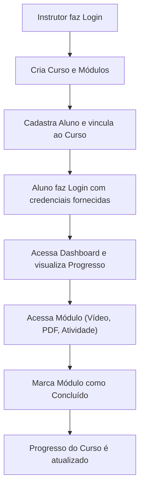

## 1. Visão Geral do Produto
A plataforma "JS Treinamentos" é um sistema web responsivo projetado para apoiar alunos em treinamentos presenciais de operação de máquinas pesadas.
- Serve como um portal onde os alunos podem acessar materiais preparatórios (videoaulas, PDFs, atividades) antes do curso presencial.
- O sistema possui foco na simplicidade, dispensando integrações complexas e pagamentos online, para oferecer uma experiência direta e profissional voltada ao setor de construção civil e segurança no trabalho.

## 2. Funcionalidades Principais

### 2.1 Perfis de Usuário
| Perfil | Método de Registro | Permissões Principais |
|--------|--------------------|-----------------------|
| Aluno | Criado manualmente pelo Instrutor | Acessar dashboard, visualizar progresso, assistir aulas, baixar PDFs, realizar atividades e marcar módulos como concluídos. |
| Instrutor (Admin) | Pré-configurado ou via DB | Acessar painel admin, gerenciar alunos, gerenciar cursos e gerenciar módulos (com controle de liberação/bloqueio). |

### 2.2 Módulos de Funcionalidades
1. **Área Pública**: Tela de login unificada ou separada (Aluno e Admin).
2. **Área do Aluno**: Dashboard, Lista de Cursos, Página do Curso, Página do Módulo.
3. **Área Administrativa**: Dashboard Admin, Gestão de Alunos, Gestão de Cursos, Gestão de Módulos.

### 2.3 Detalhamento das Páginas
| Nome da Página | Nome do Módulo | Descrição da Funcionalidade |
|----------------|----------------|-----------------------------|
| Login | Autenticação | Formulário simples de usuário e senha. |
| Dashboard (Aluno) | Visão Geral | Exibe nome do aluno, curso matriculado e barra de progresso (%). |
| Página do Curso (Aluno) | Lista de Módulos | Lista todos os módulos do curso, exibindo status (pendente/concluído). |
| Página do Módulo (Aluno) | Conteúdo | Título, descrição curta, player de videoaula, botão para baixar PDF, área para atividade simples e botão "Marcar como concluído". |
| Dashboard (Admin) | Visão Geral Admin | Resumo do sistema, atalhos rápidos. |
| Gestão de Alunos | CRUD Alunos | Listar, cadastrar (Nome, Telefone, E-mail, Usuário, Senha), editar e excluir alunos. |
| Gestão de Cursos | CRUD Cursos | Listar, criar, editar e excluir cursos (ex: Operador de Escavadeira Hidráulica). |
| Gestão de Módulos | CRUD Módulos | Criar módulos dentro dos cursos, adicionar vídeos, PDFs, atividades e controlar liberação (bloquear/desbloquear). |

## 3. Processo Principal
O fluxo principal envolve o instrutor preparando o ambiente e o aluno consumindo o conteúdo.

## 4. Design de Interface de Usuário
### 4.1 Estilo de Design
- **Cores Principais e Secundárias**: Tons de amarelo/laranja (remetendo a máquinas pesadas como Caterpillar/Komatsu e segurança) combinados com cinza escuro/chumbo e branco para um visual profissional e limpo.
- **Estilo de Botões**: Arredondamento leve (border-radius médio), com estados de hover evidentes. Botões de ação principal em amarelo/laranja.
- **Tipografia**: Fontes sem serifa modernas e robustas (ex: Inter, Roboto, ou Montserrat para títulos) para garantir legibilidade.
- **Layout**: Baseado em cards, navegação lateral (sidebar) no painel admin e navegação superior (navbar) ou inferior no mobile para alunos.
- **Iconografia**: Ícones sólidos e claros relacionados à construção civil, educação e segurança (ex: capacete, trator, livro, check).

### 4.2 Resumo do Design das Páginas
| Nome da Página | Nome do Módulo | Elementos de UI |
|----------------|----------------|-----------------|
| Login | Formulário | Fundo escuro com imagem sutil de máquina pesada, card centralizado branco, inputs limpos. |
| Dashboard (Aluno) | Resumo e Progresso | Header com saudação, Card de Curso com Barra de Progresso circular ou linear, lista de módulos em cards. |
| Página do Módulo | Conteúdo | Área de vídeo em destaque, botões de ação (PDF) bem visíveis, botão de conclusão com cor de destaque (verde). |
| Área Admin | Layout Admin | Sidebar escura, área de conteúdo clara, tabelas de dados limpas com ações (editar/excluir) em ícones. |

### 4.3 Responsividade
- A abordagem será **Desktop-first** para o Admin (pois instrutores usarão mais no PC) e **Mobile-first** adaptativo para a Área do Aluno (pois alunos tendem a acessar pelo celular).
- Interfaces otimizadas para toque no mobile.
