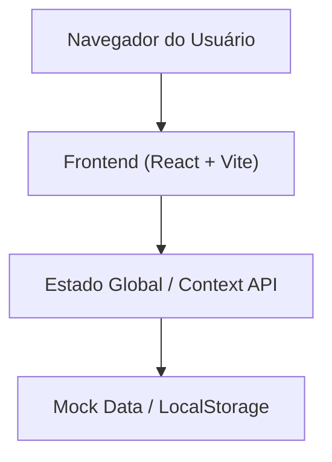
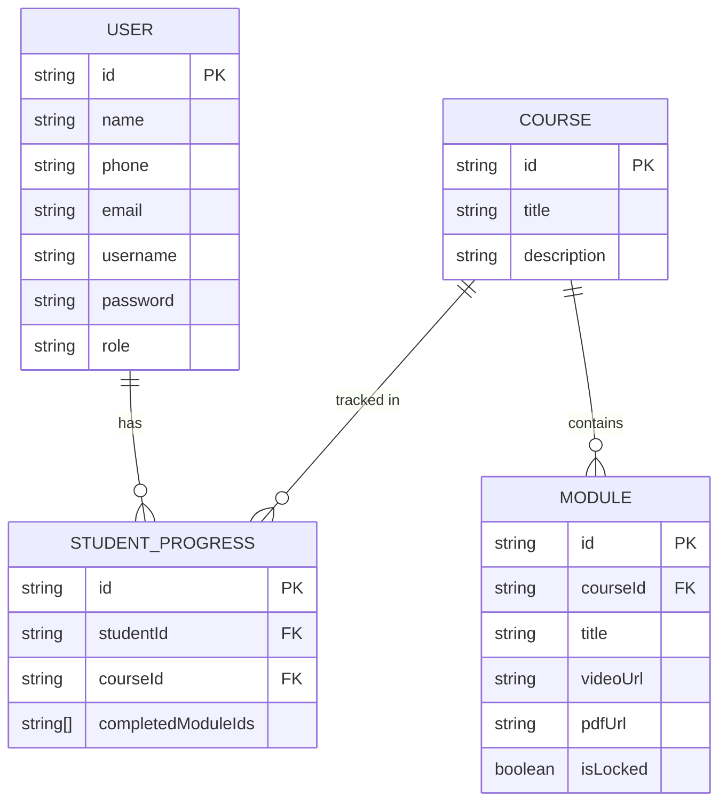

## 1. Design da Arquitetura
A arquitetura seguirá um modelo simples de frontend moderno em React, utilizando mock de dados ou armazenamento local (localStorage) em sua primeira versão simples (conforme requisitado para evitar integrações complexas agora), ou uma integração backend leve com Supabase/Firebase se necessário. Para manter a simplicidade extrema, começaremos com um frontend React robusto que simula a persistência ou utiliza SQLite/Local. Como é um ambiente de web-dev padrão Trae, usaremos React + Vite + TailwindCSS.



## 2. Descrição das Tecnologias
- **Frontend**: React@18 + TailwindCSS@3 + Vite
- **Roteamento**: React Router DOM
- **Gerenciamento de Estado**: Zustand ou React Context API (para estado de usuário autenticado e progresso)
- **Ícones**: Lucide React
- **Componentes UI**: Radix UI / Shadcn UI (para componentes acessíveis como modais e dropdowns)

## 3. Definições de Rotas
| Rota | Propósito |
|------|-----------|
| `/` | Redireciona para o Login |
| `/login` | Página de login para Alunos e Instrutores |
| `/aluno/dashboard` | Dashboard do aluno com progresso e cursos |
| `/aluno/curso/:cursoId` | Detalhes do curso e lista de módulos |
| `/aluno/modulo/:moduloId` | Visualização da videoaula, PDF, atividade e botão de conclusão |
| `/admin/dashboard` | Painel inicial do instrutor |
| `/admin/alunos` | Gestão de alunos (listar, adicionar, editar, excluir) |
| `/admin/cursos` | Gestão de cursos |
| `/admin/cursos/:cursoId/modulos` | Gestão de módulos dentro de um curso específico |

## 4. Definições de Dados (Estrutura Frontend)
Como não teremos um backend complexo, modelaremos o estado no frontend (TypeScript Interfaces):

```typescript
type Role = 'ADMIN' | 'STUDENT';

interface User {
  id: string;
  name: string;
  phone: string;
  email?: string;
  username: string;
  role: Role;
}

interface Course {
  id: string;
  title: string;
  description: string;
  imageUrl?: string;
}

interface Module {
  id: string;
  courseId: string;
  title: string;
  description: string;
  videoUrl: string;
  pdfUrl?: string;
  activityDescription?: string;
  isLocked: boolean;
}

interface StudentProgress {
  studentId: string;
  courseId: string;
  completedModuleIds: string[];
}
```

## 5. Modelo de Dados Relacional

